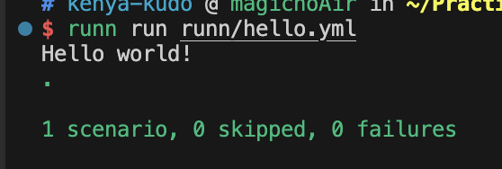

## 参考URL
[zenn runn チュートリアル](https://zenn.dev/katzumi/books/runn-tutorial/viewer/about)
[いろんなHTTPリクエストを試せるサイト: httpbin](https://httpbin.org/)


### Hello world!
```
runn run runn/hello.yml
```



### Generated by `runn new`


debug: true にするとこうなる
